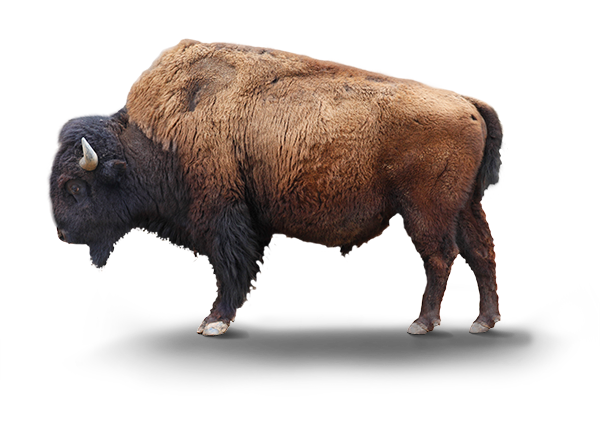

<html>
  
<body>
  
   
<h1>SUPRE RAD</h1>
  <h3>Amiright</h3>
  
    
  <a href="https://www.youtube.com/watch?v=6n3pFFPSlW4">click me</a>
  <pre style="color:yellow;">
    A poewm
      
    QWit th gob
    and get rthe nob
    hahahasasasas
    lal
    </pre>
   
  <h1>STEAK</h1>
  
   
  
Heylolhah<b>mememe</b>

  
</body>
</html>
